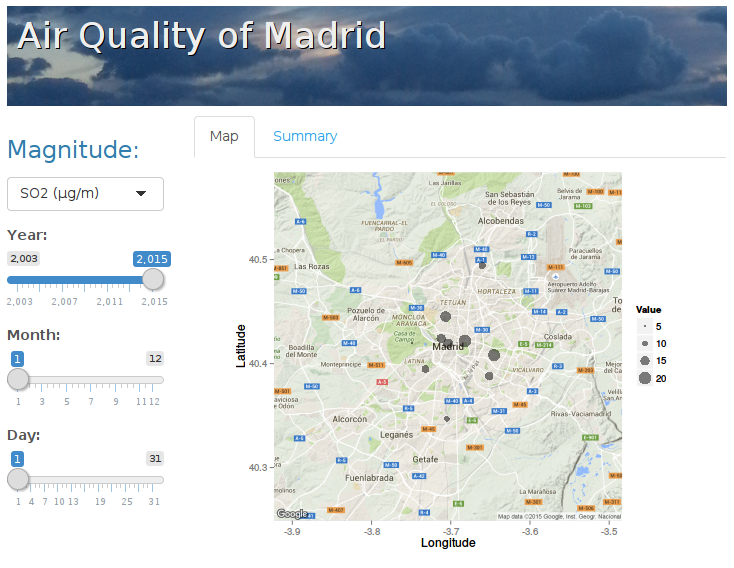
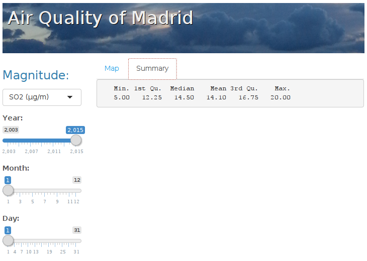

## Introduction

The Madrid Air Quality Web Application attempts to display air quality related magnitudes from the city of [Madrid](http://en.wikipedia.org/wiki/Madrid) on a map in a user friendly way.

The original datasets can be downloaded from [datos.madrid.es](http://datos.madrid.es/portal/site/egob/menuitem.c05c1f754a33a9fbe4b2e4b284f1a5a0/?vgnextoid=aecb88a7e2b73410VgnVCM2000000c205a0aRCRD&vgnextchannel=374512b9ace9f310VgnVCM100000171f5a0aRCRD), but hey are not very user friendly!


```
##         V1 V2 V3 V4 V5 V6     V7     V8     V9    V10    V11    V12    V13
## 1 28079004  1 38  4 15  1 00015V 00019V 00017V 00021V 00016V 00014V 00016V
##      V14    V15    V16    V17    V18    V19    V20    V21    V22    V23
## 1 00018V 00020V 00014V 00015V 00014V 00012V 00011V 00008V 00007V 00008V
##      V24    V25    V26    V27    V28    V29    V30    V31    V32    V33
## 1 00006V 00007V 00009V 00008V 00010V 00013V 00012V 00010V 00015V 00013V
##      V34    V35    V36    V37
## 1 00014V 00010V 00006V 00007V
```

---

## The Script

With the help of the [official documentation](http://datos.madrid.es/FWProjects/egob/contenidos/datasets/ficheros/MedioAmbiente_CalidadAire/INTPHORA-DIA_V2.2.pdf) and the [European Air Quality Database](http://www.eea.europa.eu/data-and-maps/data/airbase-the-european-air-quality-database-8) we wrote the [air.quality.madrid.R](https://github.com/nramon/MadridAirQuality/blob/master/air.quality.madrid.R) script and turned the datasets into this:


```
##    Station Magnitude AnalysisTechnique AnalysisPeriod     Date Value
## 1 28079004       SO2                38              4 2015-1-1    15
## 2 28079004       SO2                38              4 2015-2-1     7
## 3 28079004       SO2                38              4 2015-3-1     7
## 4 28079004       SO2                38              4 2015-4-1     6
##   Longitude Latitude
## 1 -3.712222 40.42417
## 2 -3.712222 40.42417
## 3 -3.712222 40.42417
## 4 -3.712222 40.42417
```

---:

## The Web Application (map) 

The next step was building the [Madrid Air Quality Web Application](https://nramon.shinyapps.io/MadridAirQuality), which allows the user to interactively generate maps from the dataset:



<style type="text/css">
img {
  display: block;
  margin-left: auto;
  margin-right: auto;
  height: auto;
}
</style>

---

## The Web Application (summary)

And also displays numeric summaries of the data:



<style type="text/css">
img {
  display: block;
  margin-left: auto;
  margin-right: auto;
  height: auto;
}
</style>
